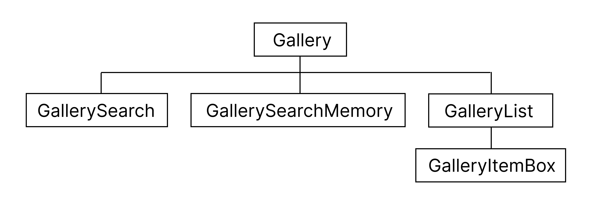

# Galley Search
- 검색어에 맞는 사진 이미지를 불러올 수 있다.
- Pixabay API를 이용해 많은 양의 데이터를 보유하고 있다.
---
## 1. 파일 구조 및 작성법
- Vite ( React JS )
- styled components
- 파일 구조
  
    
---
## 2. 결과물
- react-masonry-css 이용하여 이미지 3개씩 출력
  
    
---
## 3. code 설명
-  Pixabay API 데이터 입력
    <br> 사용자가 검색한 단어에 맞는 데이터 출력
   ```js
    useEffect(()=>{
        const url = `https://pixabay.com/api/?key=${API_KEY}&q=${text}&image_type=photo`
        axios.get(url)
            .then(res=>{
                setData(res.data.hits)
                setLoading(true)
                setError(null)
            })
            .catch(error=>{
                setData([])
                setLoading(false)
                setError('api주소를 확인하세요')

            })
    },[text])
   ```
- 검색기록 남기기
    ```js
    const onSearch=(text)=>{
        setText(text)
        setMemory([...memory, {id:no.current++ ,text}])
    }
    ```
- 검색기록 단어 클릭시 검색가능
    ```js
    const onMemory =(id)=>{
        setText(memory.find(item=>item.id === id).text)
    }
    ```
- 검색기록 삭제
    ```js
    const onDel=(id)=>{
        setMemory(memory.filter(item=>item.id !== id))
    }
    ```
---
### # 참고사이트
- Pixabay API / 2023.06.21 / 사진 api 사용 / https://pixabay.com/api/docs/